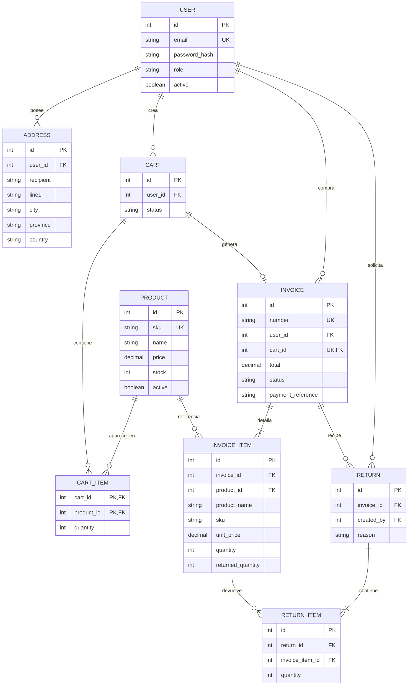

# Diseño técnico

## Diagrama entidad-relación

`REVOKED_TOKEN(jti, expires_at)` es una tabla auxiliar de seguridad y no representa una entidad del negocio; por eso no necesita CRUD público.

## Normalización

El diseño cumple tercera forma normal (3FN) para los datos operativos:

- usuarios, direcciones y productos almacenan una sola clase de entidad;
- `cart_items` resuelve la relación muchos-a-muchos entre carritos y productos mediante una clave primaria compuesta;
- `invoice_items` y `return_items` separan los detalles repetibles de sus encabezados;
- no se guardan totales calculados en el carrito.

La factura conserva deliberadamente el nombre, SKU, precio unitario y dirección de facturación como una instantánea. Esta desnormalización controlada es necesaria: una factura histórica no debe cambiar cuando el administrador renombra un producto, cambia su precio o el cliente edita su dirección. El total también se persiste como registro financiero y se calcula en el servidor al finalizar la compra.

## Integridad y concurrencia

- `price` y `stock` tienen restricciones `CHECK` para impedir valores negativos.
- El checkout vuelve a validar productos, estado y stock; no confía en la validación previa del carrito.
- Durante checkout, PostgreSQL bloquea las filas de productos con `SELECT ... FOR UPDATE`. La reducción de stock, creación de factura, detalles y cambio de estado del carrito se confirman en una misma transacción.
- Las devoluciones bloquean los detalles de factura y productos, impiden devolver más unidades de las compradas y restauran stock en la misma transacción.
- Productos y usuarios se desactivan en vez de eliminarse físicamente para conservar referencias históricas.
- Solo se registra la referencia del pago. No se almacenan credenciales bancarias ni información sensible de tarjetas.

## Autenticación y permisos

Las contraseñas se almacenan con el hash seguro de Werkzeug. El JWT está firmado con HS256, expira según `JWT_EXPIRES_MINUTES` e incluye identificadores de usuario, rol y token (`jti`). En cada solicitud se vuelve a consultar el usuario para respetar inmediatamente cambios de rol o desactivaciones. Al cerrar sesión, el `jti` pasa a `revoked_tokens` hasta que expire.

Las rutas de escritura sobre usuarios, productos y facturas exigen administrador. Los clientes pueden consultar productos y administrar únicamente sus direcciones, carritos, compras, facturas y devoluciones. Las comprobaciones de propiedad se hacen en el servidor, no mediante datos enviados por el cliente.

## Estrategia de caché

| Datos | TTL | Motivo | Invalidación |
| --- | ---: | --- | --- |
| Lista de productos | 120 s | Es una lectura frecuente y el catálogo cambia menos que las consultas | Se incrementa la versión de la clave al crear, editar, desactivar, vender o devolver |
| Detalle de producto | 300 s | Reduce lecturas repetidas de fichas individuales | Se elimina la clave del producto al editar, desactivar, vender o devolver |
| Factura por número | 600 s | Una factura confirmada cambia con poca frecuencia | Se elimina al cambiar el estado, crear una devolución o eliminar la factura |

El TTL actúa como segunda protección frente a fallos de invalidación o cambios externos. No se cachean carritos porque cambian continuamente, ni listados de usuarios por su sensibilidad y menor volumen esperado. La autorización de una factura se comprueba después de recuperar su valor del caché, de modo que el caché no evita el control de propiedad.

## Decisiones de API

- `PUT` en artículos del carrito fija la cantidad exacta y es idempotente.
- Una devolución es un recurso independiente y no una edición destructiva de la factura, lo que conserva trazabilidad.
- Los estados principales son `open/completed` para carritos y `paid/cancelled/partially_refunded/refunded` para facturas.
- Las respuestas de error usan JSON consistente con la clave `error` y códigos HTTP 400, 401, 403, 404, 409 según el caso.

## Límites y mejora futura

Para un despliegue productivo se recomienda añadir migraciones versionadas, rotación de secretos, HTTPS, limitación de intentos de inicio de sesión, limpieza periódica de JWT revocados ya vencidos y un proveedor de pagos que verifique la referencia antes de confirmar la venta.
